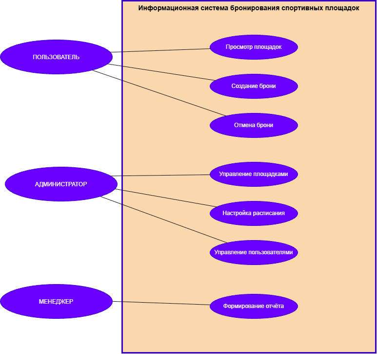
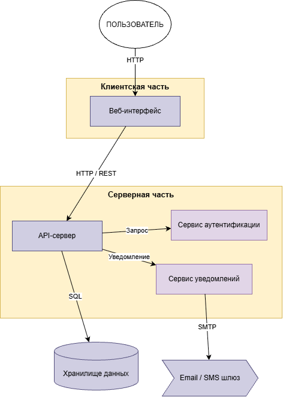

# Отчет по лабораторной работе №2

## Задание

**Вариант 7. Система бронирования спортивных площадок**

На основе предметной области, выбранной в лабораторной работе №1, необходимо спроектировать архитектуру информационной системы бронирования спортивных площадок: уточнить описание предметной области, определить пользователей и их роли, описать сценарии использования, определить компоненты системы, построить диаграммы Use Case и компонентов, разработать концепцию архитектуры.

## 1. Описание предметной области

**Проблема:** В настоящее время бронирование спортивных площадок часто осуществляется по телефону или через устные договорённости, что приводит к путанице, двойному бронированию, отсутствию единого расписания и сложностям с контролем загрузки площадок.

**Цель:** Разработать информационную систему для централизованного бронирования спортивных площадок, которая позволит пользователям самостоятельно выбирать площадку и время, а администраторам — управлять площадками и расписанием.

**Область применения:** Система предназначена для использования в спортивных комплексах, фитнес-центрах, учебных заведениях и других организациях, предоставляющих в аренду спортивные площадки.

## 2. Пользователи и роли

| Роль | Назначение | Основные функции | Уровень доступа |
|------|------------|------------------|-----------------|
| **Пользователь** | Бронирование площадок | Просмотр доступных площадок, выбор времени, создание брони, отмена брони, просмотр своих броней | Только свои брони |
| **Администратор** | Управление площадками и расписанием | Добавление и редактирование площадок, настройка расписания, подтверждение и отмена броней, управление пользователями | Полный доступ к площадкам и расписанию |
| **Менеджер** | Контроль загрузки и финансов | Просмотр отчётов по бронированиям, управление ценами, работа с клиентами | Просмотр отчётов и цен |
| **Система** | Автоматические операции | Проверка пересечений броней, отправка уведомлений, формирование напоминаний | Автоматический доступ к данным броней |

## 3. Сценарии использования

### Сценарий 1. Просмотр доступных площадок
- **Инициатор:** Пользователь
- **Шаги:**
  1. Пользователь входит в систему.
  2. Переходит в раздел «Площадки».
  3. Выбирает вид спорта и дату.
  4. Система отображает список доступных площадок с ценой и расписанием.
  5. Пользователь может отфильтровать площадки по типу покрытия или вместимости.
- **Результат:** Пользователь видит доступные площадки и их характеристики.

### Сценарий 2. Создание брони
- **Инициатор:** Пользователь
- **Шаги:**
  1. Пользователь выбирает площадку и дату.
  2. Система показывает свободные временные слоты.
  3. Пользователь выбирает время начала и окончания.
  4. Система проверяет отсутствие пересечений с другими бронями.
  5. Пользователь подтверждает бронирование.
  6. Система сохраняет бронь и отправляет уведомление.
- **Результат:** Бронирование создано, пользователь получил подтверждение.

### Сценарий 3. Отмена брони
- **Инициатор:** Пользователь
- **Шаги:**
  1. Пользователь входит в систему.
  2. Переходит в раздел «Мои брони».
  3. Выбирает активную бронь.
  4. Нажимает «Отменить».
  5. Система проверяет, что до начала брони осталось больше допустимого времени.
  6. Бронь отменяется, слот освобождается.
- **Результат:** Бронь отменена, пользователь уведомлён.

### Сценарий 4. Управление площадками
- **Инициатор:** Администратор
- **Шаги:**
  1. Администратор входит в систему.
  2. Переходит в раздел «Площадки» → «Добавить».
  3. Заполняет название, вид спорта, тип покрытия, вместимость, стоимость.
  4. Сохраняет площадку.
  5. При необходимости редактирует или удаляет существующие площадки.
- **Результат:** Список площадок актуализирован.

### Сценарий 5. Настройка расписания
- **Инициатор:** Администратор
- **Шаги:**
  1. Администратор выбирает площадку.
  2. Переходит в раздел «Расписание».
  3. Указывает дни недели и часы работы.
  4. Устанавливает перерывы и технические окна.
  5. Сохраняет расписание.
- **Результат:** Расписание площадки обновлено.

### Сценарий 6. Формирование отчёта по загрузке
- **Инициатор:** Менеджер
- **Шаги:**
  1. Менеджер входит в систему.
  2. Переходит в раздел «Отчёты».
  3. Выбирает период и площадку.
  4. Система формирует отчёт по количеству броней и загрузке.
  5. Менеджер может экспортировать отчёт в Excel.
- **Результат:** Получен отчёт о загрузке площадок.

## 4. Диаграмма сценариев использования (Use Case)

**Описание диаграммы:**
- **Актёры:** Пользователь, Администратор, Менеджер.
- **Сценарии:** Просмотр площадок, Создание брони, Отмена брони, Управление площадками, Настройка расписания, Формирование отчёта, Управление пользователями.
- **Границы системы:** прямоугольник «Информационная система бронирования спортивных площадок».

## 5. Компоненты системы

| Компонент | Назначение | Взаимодействует с |
|-----------|------------|-------------------|
| **Веб-интерфейс (Frontend)** | Отображение площадок, расписания и броней пользователю | API-сервер |
| **API-сервер (Backend)** | Обработка запросов, проверка пересечений броней, бизнес-логика | Веб-интерфейс, хранилище данных, сервис аутентификации, сервис уведомлений |
| **Хранилище данных** | Хранение информации о площадках, бронях, пользователях, расписании | API-сервер |
| **Сервис аутентификации** | Проверка логина и пароля, выдача прав доступа | API-сервер |
| **Сервис уведомлений** | Отправка email/SMS о подтверждении и отмене броней, напоминания | API-сервер, Email/SMS-шлюз |
| **Email/SMS-шлюз** | Внешний сервис для отправки сообщений | Сервис уведомлений |

## 6. Диаграмма компонентов

**Описание диаграммы:**
- **Пользователь** взаимодействует с **Веб-интерфейсом**.
- Веб-интерфейс отправляет HTTP/REST-запросы к **API-серверу**.
- API-сервер обращается к **хранилищу данных**, **сервису аутентификации** и **сервису уведомлений**.
- Сервис уведомлений отправляет сообщения через **Email/SMS-шлюз**.
- Все компоненты находятся внутри границы системы, кроме внешнего Email/SMS-шлюза.

## 7. Концепция информационной системы

**Назначение и цель:** Централизованное бронирование спортивных площадок для повышения удобства пользователей и эффективности управления загрузкой.

**Основные возможности:**
- Ведение учёта площадок и их характеристик.
- Формирование и просмотр расписания.
- Создание, просмотр и отмена броней.
- Проверка пересечений броней.
- Формирование отчётов по загрузке.
- Разграничение доступа по ролям.
- Уведомления пользователей.

**Тип системы:** Веб-приложение (доступ через браузер).

**Основные компоненты и их взаимодействие:**
1. Пользователь работает через веб-интерфейс.
2. Веб-интерфейс обращается к API-серверу.
3. API-сервер обрабатывает логику и работает с хранилищем данных.
4. Для аутентификации используется отдельный сервис.
5. Уведомления отправляются через внешний шлюз.