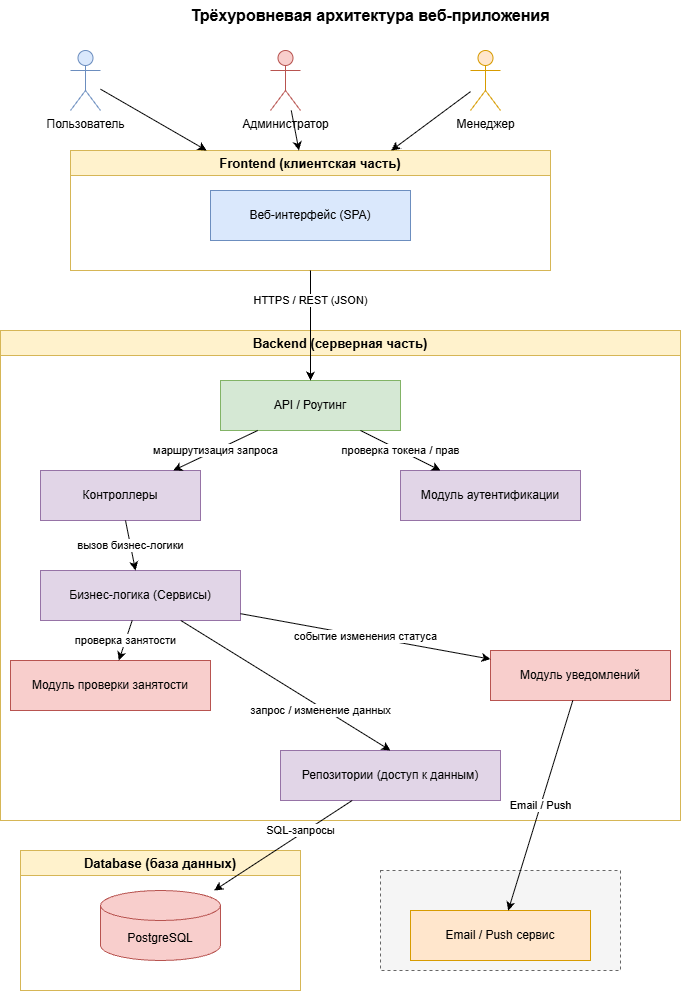
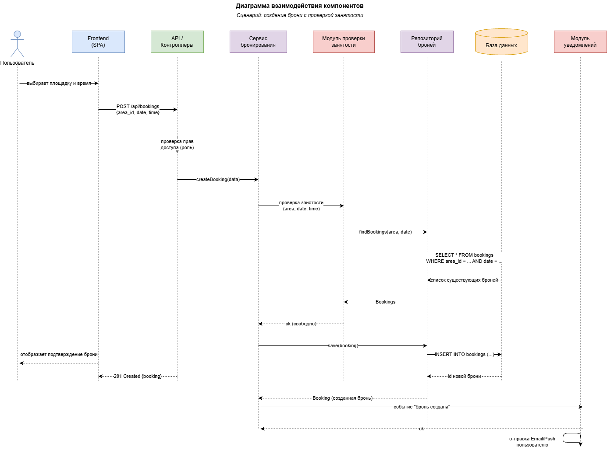

# Лабораторная работа №3

## Проектирование архитектуры информационной системы

## Цель работы

Изучить принципы проектирования архитектуры информационных систем, определить структуру приложения, спроектировать взаимодействие между основными компонентами и подготовить структуру программного проекта для дальнейшей разработки.

## Краткое описание задания

На основе результатов предыдущих лабораторных работ разработана архитектура информационной системы бронирования спортивных площадок. Определён архитектурный стиль, выделены компоненты системы, описано их взаимодействие, определена индивидуальная особенность предметной области, разработана структура проекта и подготовлены архитектурные диаграммы.

## 1. Архитектура приложения

Выбран архитектурный стиль — **трёхуровневая (3-tier) архитектура веб-приложения**. Такой подход разделяет систему на три независимых уровня, каждый из которых можно разрабатывать, тестировать и масштабировать отдельно.

| Уровень | Назначение |
|---------|------------|
| **Frontend (клиентская часть)** | Веб-интерфейс: просмотр площадок, выбор времени, оформление брони, просмотр своих броней |
| **Backend (серверная часть)** | Обработка HTTP-запросов, бизнес-логика: проверка занятости площадки, расчёт стоимости, разграничение доступа, формирование отчётов |
| **Database (база данных)** | Постоянное хранение данных о площадках, пользователях, бронированиях и расписании |

**Преимущества выбранного подхода:**
- независимая разработка и тестирование каждого уровня;
- возможность замены одного уровня без переписывания остальных;
- удобство масштабирования backend при росте нагрузки.

**Тип приложения:** веб-приложение, доступное через браузер.

## 2. Компоненты системы

| Компонент | Ответственность |
|-----------|-----------------|
| **Веб-интерфейс (Frontend)** | Отображение площадок, расписания и броней пользователю. Отправка запросов к API. |
| **API** | Приём HTTP-запросов, маршрутизация, формирование ответов. |
| **Контроллеры** | Обработка конкретных запросов (создание брони, отмена брони, управление площадками). |
| **Сервисы** | Бизнес-логика: проверка пересечений броней, расчёт стоимости, применение правил предметной области. |
| **Репозитории** | Доступ к базе данных: чтение и запись площадок, броней, пользователей, расписания. |
| **Модели** | Описание структуры данных предметной области: Площадка, Пользователь, Бронирование, Расписание. |
| **База данных** | Постоянное хранение структурированных данных системы. |
| **Модуль проверки занятости** | Индивидуальный компонент: проверка доступности площадки на выбранное время «на лету». |
| **Модуль уведомлений** | Отправка Email/SMS о подтверждении и отмене брони. |

## 3. Взаимодействие компонентов

Последовательность обработки запроса пользователя на создание брони:

1. Пользователь через веб-интерфейс выбирает площадку и время.
2. Frontend отправляет HTTP-запрос к API.
3. API передаёт запрос контроллеру бронирования.
4. Контроллер вызывает сервис бронирования.
5. Сервис обращается к модулю проверки занятости.
6. Модуль проверки занятости через репозиторий запрашивает данные о существующих бронях из базы данных.
7. Если время свободно — сервис создаёт бронь через репозиторий и сохраняет её в базе данных.
8. Модуль уведомлений отправляет пользователю подтверждение по Email/SMS.
9. Ответ возвращается пользователю: бронь успешно создана.

Если время занято — система возвращает ошибку и предлагает выбрать другой слот.

## 4. Индивидуальная особенность предметной области

**Особенность:** проверка занятости площадки на конкретную дату и время «на лету» для предотвращения двойного бронирования.

**Почему это важно:** в системе бронирования критично, чтобы два пользователя не смогли забронировать одну и ту же площадку на одно и то же время. Обычный CRUD здесь недостаточен: перед сохранением брони нужно проверить пересечения с уже существующими бронями, учитывая расписание и возможные отмены.

**Отвечающий компонент:** «Модуль проверки занятости». Он входит в серверную часть, взаимодействует с сервисом бронирования, репозиторием броней и базой данных.

**Отражение в архитектуре:** компонент показан на диаграмме архитектуры и участвует в диаграмме взаимодействия.

## 5. Структура проекта
```
project/
├── frontend/
├── backend/
│   ├── controllers/
│   ├── services/
│   ├── repositories/
│   ├── models/
│   └── routes/
├── database/
├── docs/
└── README.md
```
**Пояснение:**
- `frontend/` — клиентская часть (веб-интерфейс).
- `backend/` — серверная часть, разделённая по типу компонентов:
  - `controllers/` — обработка HTTP-запросов;
  - `services/` — бизнес-логика (в том числе проверка занятости площадки);
  - `repositories/` — доступ к данным;
  - `models/` — описание сущностей предметной области;
  - `routes/` — маршрутизация API.
- `database/` — миграции и скрипты для базы данных.
- `docs/` — документация проекта.
- `README.md` — описание проекта.

## 6. Диаграмма архитектуры



**Описание:** на схеме показаны три уровня (Frontend, Backend, Database), основные компоненты внутри Backend (API, контроллеры, сервисы, репозитории, модели), а также индивидуальный компонент — «Модуль проверки занятости» и «Модуль уведомлений». Связи подписаны: HTTP-запросы между Frontend и API, SQL-запросы между репозиториями и базой данных.

## 7. Диаграмма взаимодействия



**Описание:** на диаграмме показана последовательность обработки запроса на создание брони. Участники: Пользователь, Клиент (Frontend), Сервер (Backend), Модуль проверки занятости, База данных. Стрелки показывают порядок вызовов и ответов.

## 8. Вывод

В ходе лабораторной работы была спроектирована архитектура информационной системы бронирования спортивных площадок на основе трёхуровневой модели. Выделены основные компоненты системы и описано их взаимодействие. Определена индивидуальная особенность предметной области — проверка занятости площадки «на лету» для предотвращения двойного бронирования, и выделен отвечающий за неё компонент. Разработана структура проекта и подготовлены архитектурные диаграммы, которые станут основой для дальнейшей реализации системы.
