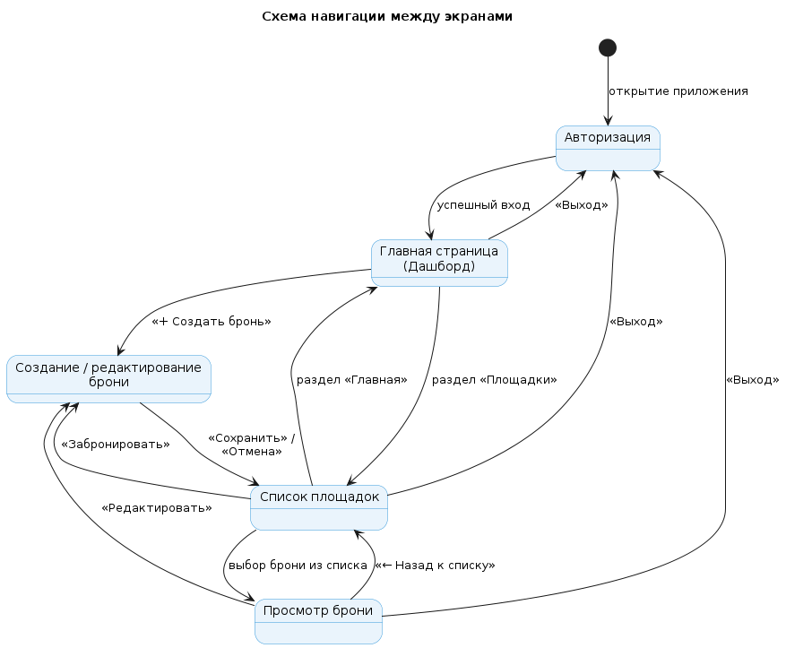
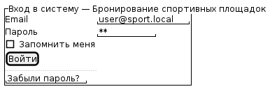
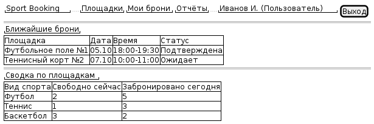
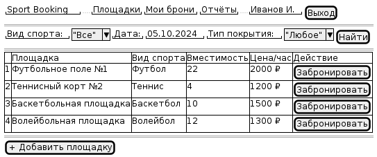
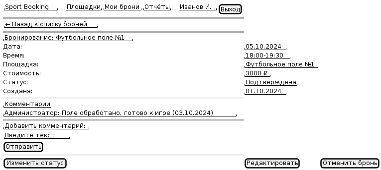
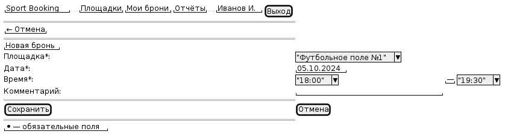

# Лабораторная работа №4

## Проектирование пользовательского интерфейса

## Цель работы

Изучить основные принципы проектирования пользовательских интерфейсов, разработать структуру экранов информационной системы, спроектировать навигацию и подготовить интерактивные или статические макеты страниц.

## Краткое описание задания

На основе архитектуры информационной системы бронирования спортивных площадок разработан пользовательский интерфейс приложения: определены экраны системы, спроектирована навигация между ними, подготовлены wireframe-прототипы основных страниц.

## 1. Структура экранов

| № | Экран | Назначение | Основные элементы | Действия пользователя |
|---|-------|------------|-------------------|----------------------|
| 1 | Авторизация | Вход в систему | Поля Email и Пароль, кнопка «Войти», ссылка «Забыли пароль?» | Ввод данных, вход |
| 2 | Главная страница (Дашборд) | Обзор броней и площадок | Шапка, меню, список ближайших броней, сводка по площадкам | Переход в разделы, выход |
| 3 | Список площадок | Просмотр и фильтрация площадок | Фильтры (вид спорта, дата), таблица площадок, кнопка «Забронировать» | Фильтрация, выбор площадки |
| 4 | Просмотр брони | Детали конкретной брони | Информация о брони, кнопки «Отменить», «Редактировать» | Отмена, редактирование |
| 5 | Создание / редактирование брони | Оформление новой брони | Форма выбора площадки, даты, времени, подтверждение | Сохранение, отмена |

## 2. Навигация между экранами

Навигация построена вокруг главной страницы (дашборда) как центральной точки — пользователь может попасть на неё из любого раздела, а также перемещается между списком площадок, карточкой брони и формой создания/редактирования.

На схеме:
- состояния (прямоугольники) — экраны системы;
- стрелки — переходы между экранами;
- подписи — действия пользователя (например, «успешный вход», «выбор площадки», «Забронировать»).

## 3. Прототипы страниц

Прототипы выполнены в низкодетализированном формате (Wireframe) с помощью PlantUML Salt — это позволяет быстро вносить изменения и хранить макеты как текстовый код рядом с документацией.

### Экран 1. Авторизация

### Экран 2. Главная страница (Дашборд)

### Экран 3. Список площадок

### Экран 4. Просмотр брони

### Экран 5. Создание / редактирование брони

## 4. Макеты пользовательского интерфейса

Все wireframe-прототипы выполнены в PlantUML Salt. Исходники находятся в папке `design/src/`:

- `design/src/login.puml`
- `design/src/dashboard.puml`
- `design/src/area-list.puml`
- `design/src/booking-detail.puml`
- `design/src/booking-form.puml`
- `design/src/navigation.puml`

## 5. Принятые решения по организации интерфейса

- **Единый стиль шапки** на всех экранах: логотип, главное меню, имя пользователя, кнопка выхода.
- **Центральная точка навигации** — дашборд: с него можно попасть в любой раздел.
- **Минимум действий** для основных операций: бронирование в 2 клика (выбор площадки → подтверждение).
- **Разграничение по ролям:** пользователь видит только свои брони, администратор — управление площадками, менеджер — отчёты.
- **Wireframe вместо mockup** — на этом этапе важно проверить логику расположения, а не визуальный стиль.

## 6. Вывод

В ходе лабораторной работы был спроектирован пользовательский интерфейс информационной системы бронирования спортивных площадок. Определены 5 основных экранов, разработана схема навигации, подготовлены wireframe-прототипы страниц. Интерфейс построен вокруг дашборда как центральной точки, обеспечивает понятную навигацию и минимальное количество действий для ключевых операций. Прототипы выполнены в PlantUML Salt, что позволяет хранить макеты как текстовые исходники рядом с остальной документацией.
